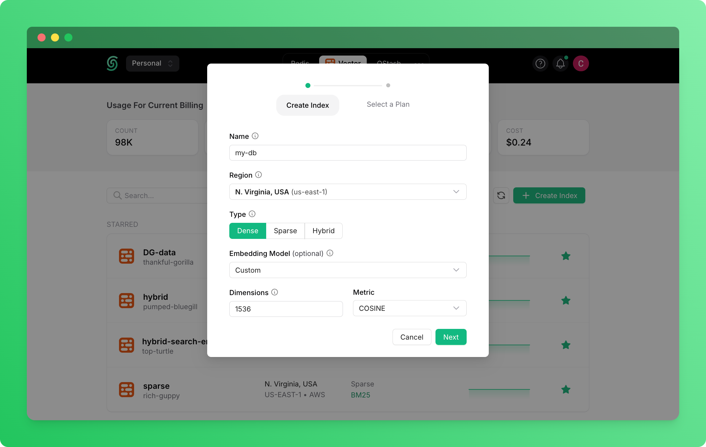
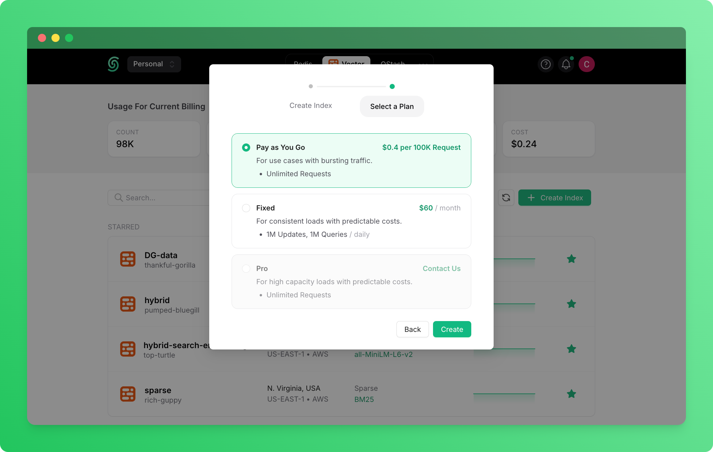
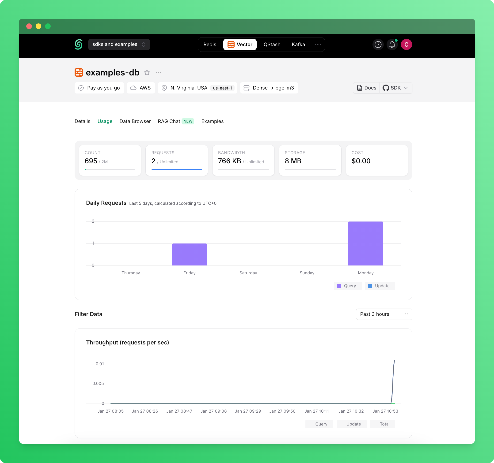

<a href="https://upstash.com/">
  
  <h1 align="center">Upstash RAG AI Chatbot</h1>
</a>

<p align="center">
    A free, open-source RAG chatbot template built with Next.js, Upstash Vector, and the AI SDK that helps you quickly build powerful context-aware chatbot applications. Based on <a href="https://github.com/vercel/ai-chatbot">Vercel's AI chatbot</a> repository.
</p>

<p align="center">
  <a href="#features"><strong>Features</strong></a> ·
  <a href="#model-providers"><strong>Model Providers</strong></a> ·
  <a href="#deploying-to-vercel"><strong>Deploying to Vercel</strong></a> ·
  <a href="#running-locally"><strong>Running locally</strong></a>
</p>
<br/>

## Features

- [Next.js](https://nextjs.org) App Router
  - Advanced routing for seamless navigation and performance
  - React Server Components (RSCs) and Server Actions for server-side rendering and increased performance
- [Upstash Vector](https://upstash.com/vector)
  - Serverless vector database for storing and retrieving embeddings
  - Fast similarity search for effective Retrieval Augmented Generation (RAG)
  - Scales automatically with your application needs
- [Cohere](https://cohere.com/)
  - Optional reranking capability to improve relevance of retrieved contexts
  - Enhanced accuracy of responses by prioritizing the most relevant information
- [AI SDK](https://sdk.vercel.ai/docs)
  - Unified API for generating text, structured objects, and tool calls with LLMs
  - Hooks for building dynamic chat and generative user interfaces
  - Supports xAI (default), OpenAI, Fireworks, and other model providers
- [shadcn/ui](https://ui.shadcn.com)
  - Styling with [Tailwind CSS](https://tailwindcss.com)
  - Component primitives from [Radix UI](https://radix-ui.com) for accessibility and flexibility
- Data Persistence
  - [Neon Serverless Postgres](https://vercel.com/marketplace/neon) for saving chat history and user data
  - [Vercel Blob](https://vercel.com/storage/blob) for efficient file storage
- [Auth.js](https://authjs.dev)
  - Simple and secure authentication

## Setting Up Upstash Vector

To use the RAG capabilities of this chatbot, you need an Upstash Vector database. Follow these steps to create and configure one:

1.  **Create an Upstash Account**:
    *   Go to [upstash.com](https://upstash.com/) and sign up for a free account if you don't have one.

2.  **Create a Vector Database**:
    *   Log in to the [Upstash Console](https://console.upstash.com/).
    *   Navigate to the "Vector" section from the sidebar.
    *   Click the "Create Index" button.
    *   

3.  **Configure the Database**:
    *   **Database Name**: Give your database a descriptive name (e.g., `rag-chatbot-vector`).
    *   **Primary Region**: Choose the region closest to your application deployment (e.g., where you deploy your Vercel app) for the lowest latency.
    *   **Embedding Model**: Select an Upstash embedding model; the database sets the correct vector dimension automatically. See [Upstash Embedding Models](https://upstash.com/docs/vector/features/embeddingmodels) for full list. For example:
        *   mixedbread-ai/mxbai-embed-large-v1 (1024)
        *   BAAI/bge-base-en-v1.5 (768)
        *   sentence-transformers/all-MiniLM-L6-v2 (384)
        *   BAAI/bge-m3 (1024)
        *   BM25 (sparse/hybrid)
    *   **Distance Metric**: Select the distance metric appropriate for your embeddings. For text embeddings, **Cosine** similarity is typically recommended.
    *   **Type**: Choose the plan that suits your needs. The "Free" tier is sufficient for getting started and development.
    *   Click "Create".
    *   

4.  **Get API Credentials**:
    *   Once the index is created, navigate to its details page in the Upstash Console.
    *   Under the "Details" tab, you will find your **REST URL** and **Read/Write Token** under "Connect to your index" section.
    *   Click the copy icons to copy these values.

5.  **Add Credentials to Environment Variables**:
    *   **For Local Development**: Open your project's `.env.local` file (or create one by copying `.env.example`). Add or update the following lines with the credentials you copied:
      ```dotenv
      # Upstash Vector
      UPSTASH_VECTOR_REST_URL=YOUR_COPIED_REST_URL
      UPSTASH_VECTOR_REST_TOKEN=YOUR_COPIED_READ_WRITE_TOKEN
      ```
    *   Replace `YOUR_COPIED_REST_URL` and `YOUR_COPIED_READ_WRITE_TOKEN` with the actual values.
    *   **Important for Local**: Ensure this `.env.local` file is listed in your `.gitignore` and is *not* committed to your repository.
    *   **For Vercel Deployment**: When deploying on Vercel, add these environment variables through the Vercel dashboard under **Settings > Environment Variables**. Use the same variable names and paste the respective values.

Your application is now configured to connect to your Upstash Vector database. The next step is to upload content to enable RAG functionality.

### Uploading Content into Upstash Vector

To enable the RAG functionality, you need to upload content into the Upstash Vector database. This process involves upserting documents or data points that will be used for similarity searches during chatbot interactions. There are two ways to do this:

#### Method 1: Using the Upstash Console

The Upstash Console provides a user-friendly interface for uploading PDF documents directly into your vector database. Or you can use sample PDF file to test the chatbot.

1. **Access the Console**: 
   - Log in to your Upstash account at [console.upstash.com](https://console.upstash.com/)
   - Navigate to the Vector service dashboard from the sidebar

2. **Select Your Index**: 
   - Find and click on the vector index you created earlier from the list of available indexes

3. **Upload PDF Documents**: 
   - Navigate to the "Data Browser" tab in your index dashboard
   - Click the "Upsert" button to open the upload interface
   - **Note**: This method doesn't work if you've selected 'Custom' embedding model for your index
   - Choose your PDF file(s) from your local system
   - Configure optional settings:
     - **Chunk Size**: Controls how your document is split (default is usually appropriate)
     - **Chunk Overlap**: Determines the overlap between consecutive chunks (default is usually appropriate)
   - Click "Upload" to process and embed your documents

4. **Verify Your Uploads**: 
   - After processing completes, stay in the Data Browser tab to view your uploaded documents
   - Verify that your document chunks appear correctly in the index
   - You can search through your uploaded content to test retrieval

#### Method 2: Using the Upstash Vector API/SDK

- **Prepare Your Data**: Format your documents or data into a structure compatible with Upstash Vector. With Upstash's built-in embedding models, you can directly upsert raw text data without manually converting it to vectors.
- **Upsert Documents**: Use the Upstash Vector API or SDK to upsert your data. The `upsert` operation adds new documents or updates existing ones in the vector index. You can do this via a script or integrate it into your application. For example, in Python:
  ```python
  from upstash_vector import Index

  index = Index(
      url="UPSTASH_VECTOR_REST_URL",
      token="UPSTASH_VECTOR_REST_TOKEN",
  )

  index.upsert(
      [("id-0", "Upstash is a serverless data platform.", {"field": "value"})],
  )
  ```
- **Query Data**: Use the API to query your index for relevant content. For example, in Python:
  ```python
  from upstash_vector import Index

  index = Index(
      url="UPSTASH_VECTOR_REST_URL",
      token="UPSTASH_VECTOR_REST_TOKEN",
  )

  index.query(
      data="What is Upstash?",
      top_k=1,
      include_metadata=True,
  )
  ```
- **Batch Uploads**: For efficiency, upload multiple documents in batches to minimize API calls.

## Monitoring Your Upstash Vector Usage

The Upstash Console provides usage metrics for your vector database to help you monitor performance and costs:

- **Access Usage Dashboard**: In your vector index details page, navigate to the "Usage" tab
- **View Key Metrics**: See request counts, storage usage, and throughput over time
- **Data Browser**: Examine your uploaded documents, perform test queries, and verify search results



## Model Providers

This template ships with [xAI](https://x.ai) `grok-2-1212` as the default chat model. However, with the [AI SDK](https://sdk.vercel.ai/docs), you can switch LLM providers to [OpenAI](https://openai.com), [Anthropic](https://anthropic.com), [Cohere](https://cohere.com/), and [many more](https://sdk.vercel.ai/providers/ai-sdk-providers) with just a few lines of code.

## Deploy Your Own

You can deploy your own version of the Upstash RAG AI Chatbot to Vercel with one click:

[](https://vercel.com/new/clone?repository-url=https%3A%2F%2Fgithub.com%2Fupstash%2Fai-chatbot-with-rag&env=AUTH_SECRET,COHERE_API_KEY,UPSTASH_VECTOR_REST_TOKEN,UPSTASH_VECTOR_REST_URL&envDescription=Learn%20more%20about%20how%20to%20get%20the%20API%20Keys%20for%20the%20application&envLink=https%3A%2F%2Fgithub.com%2Fupstash%2Fai-chatbot-with-rag%2F.env.example&products=%5B%7B%22type%22%3A%22integration%22%2C%22protocol%22%3A%22ai%22%2C%22productSlug%22%3A%22grok%22%2C%22integrationSlug%22%3A%22xai%22%7D%2C%7B%22type%22%3A%22integration%22%2C%22protocol%22%3A%22storage%22%2C%22productSlug%22%3A%22neon%22%2C%22integrationSlug%22%3A%22neon%22%7D%2C%7B%22type%22%3A%22blob%22%7D%5D)

## Running locally

You will need to use the environment variables [defined in `.env.example`](.env.example) to run Upstash RAG AI Chatbot. It's recommended you use [Vercel Environment Variables](https://vercel.com/docs/projects/environment-variables) for this, but a `.env` file is all that is necessary.

> Note: You should not commit your `.env` file or it will expose secrets that will allow others to control access to your various AI and authentication provider accounts.

1. Install Vercel CLI: `npm i -g vercel`
2. Link local instance with Vercel and GitHub accounts (creates `.vercel` directory): `vercel link`
3. Download your environment variables: `vercel env pull`

```bash
pnpm install
pnpm dev
```

Your app template should now be running on [localhost:3000](http://localhost:3000).
