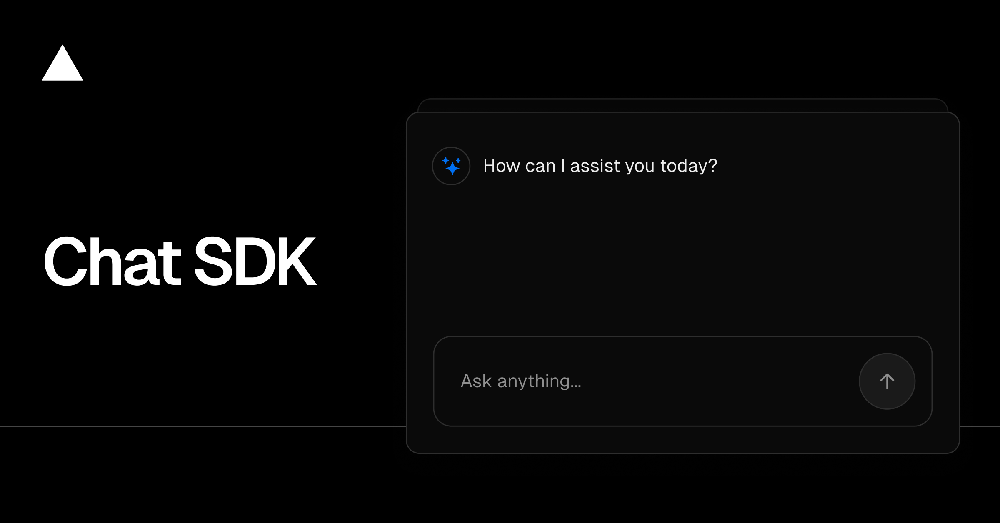

<a href="https://upstash.com/">
  
  <h1 align="center">Upstash RAG AI Chatbot</h1>
</a>

<p align="center">
    A free, open-source RAG chatbot template built with Next.js, Upstash Vector, and the AI SDK that helps you quickly build powerful context-aware chatbot applications. Based on <a href="https://github.com/vercel/ai-chatbot">Vercel's AI chatbot</a> repository.
</p>

<p align="center">
  <a href="#features"><strong>Features</strong></a> ·
  <a href="#model-providers"><strong>Model Providers</strong></a> ·
  <a href="#deploy-your-own"><strong>Deploy Your Own</strong></a> ·
  <a href="#running-locally"><strong>Running locally</strong></a>
</p>
<br/>

## Features

- [Next.js](https://nextjs.org) App Router
  - Advanced routing for seamless navigation and performance
  - React Server Components (RSCs) and Server Actions for server-side rendering and increased performance
- [Upstash Vector](https://upstash.com/vector)
  - Serverless vector database for storing and retrieving embeddings
  - Fast similarity search for effective Retrieval Augmented Generation (RAG)
  - Scales automatically with your application needs
- [Cohere](https://cohere.com/)
  - Optional reranking capability to improve relevance of retrieved contexts
  - Enhanced accuracy of responses by prioritizing the most relevant information
- [AI SDK](https://sdk.vercel.ai/docs)
  - Unified API for generating text, structured objects, and tool calls with LLMs
  - Hooks for building dynamic chat and generative user interfaces
  - Supports xAI (default), OpenAI, Fireworks, and other model providers
- [shadcn/ui](https://ui.shadcn.com)
  - Styling with [Tailwind CSS](https://tailwindcss.com)
  - Component primitives from [Radix UI](https://radix-ui.com) for accessibility and flexibility
- Data Persistence
  - [Neon Serverless Postgres](https://vercel.com/marketplace/neon) for saving chat history and user data
  - [Vercel Blob](https://vercel.com/storage/blob) for efficient file storage
- [Auth.js](https://authjs.dev)
  - Simple and secure authentication

## Model Providers

This template ships with [xAI](https://x.ai) `grok-2-1212` as the default chat model. However, with the [AI SDK](https://sdk.vercel.ai/docs), you can switch LLM providers to [OpenAI](https://openai.com), [Anthropic](https://anthropic.com), [Cohere](https://cohere.com/), and [many more](https://sdk.vercel.ai/providers/ai-sdk-providers) with just a few lines of code.

## Uploading Content into Upstash Vector

To enable the RAG functionality, you need to upload content into the Upstash Vector database. This process involves upserting documents or data points that will be used for similarity searches during chatbot interactions. There are two ways to do this:

### Method 1: Using the Upstash Vector API/SDK

- **Prepare Your Data**: Format your documents or data into a structure compatible with Upstash Vector. Typically, this involves converting text into embeddings using a model like OpenAI's embeddings.
- **Upsert Documents**: Use the Upstash Vector API or SDK to upsert your data. The `upsert` operation adds new documents or updates existing ones in the vector index. You can do this via a script or integrate it into your application. For example, in JavaScript:
  ```javascript
  await index.upsert({
    id: 'doc1',
    vector: embedding,
    data: { title: 'Sample Document' }
  });
  ```
- **Batch Uploads**: For efficiency, upload multiple documents in batches to minimize API calls.

### Method 2: Using the Upstash Console

- **Access the Console**: Log in to your Upstash account and navigate to the Vector service dashboard.
- **Select Your Index**: Choose the vector index you want to upload content to.
- **Manual Upload**: Use the console interface to manually upload documents, either individually or by importing JSON files containing your vector data.
- **Visualize Data**: The console provides visualization tools to help you understand your vector space and verify your uploads.

## Deploy Your Own

You can deploy your own version of the Upstash RAG AI Chatbot to Vercel with one click:

[](https://vercel.com/new/clone?repository-url=https%3A%2F%2Fgithub.com%2Fupstash%2Fai-chatbot-with-rag&env=AUTH_SECRET,COHERE_API_KEY,UPSTASH_VECTOR_REST_TOKEN,UPSTASH_VECTOR_REST_URL&envDescription=Learn%20more%20about%20how%20to%20get%20the%20API%20Keys%20for%20the%20application&envLink=https%3A%2F%2Fgithub.com%2Fupstash%2Fai-chatbot-with-rag%2F.env.example&products=%5B%7B%22type%22%3A%22integration%22%2C%22protocol%22%3A%22ai%22%2C%22productSlug%22%3A%22grok%22%2C%22integrationSlug%22%3A%22xai%22%7D%2C%7B%22type%22%3A%22integration%22%2C%22protocol%22%3A%22storage%22%2C%22productSlug%22%3A%22neon%22%2C%22integrationSlug%22%3A%22neon%22%7D%2C%7B%22type%22%3A%22blob%22%7D%5D)

## Running locally

You will need to use the environment variables [defined in `.env.example`](.env.example) to run Upstash RAG AI Chatbot. It's recommended you use [Vercel Environment Variables](https://vercel.com/docs/projects/environment-variables) for this, but a `.env` file is all that is necessary.

> Note: You should not commit your `.env` file or it will expose secrets that will allow others to control access to your various AI and authentication provider accounts.

1. Install Vercel CLI: `npm i -g vercel`
2. Link local instance with Vercel and GitHub accounts (creates `.vercel` directory): `vercel link`
3. Download your environment variables: `vercel env pull`

```bash
pnpm install
pnpm dev
```

Your app template should now be running on [localhost:3000](http://localhost:3000).
